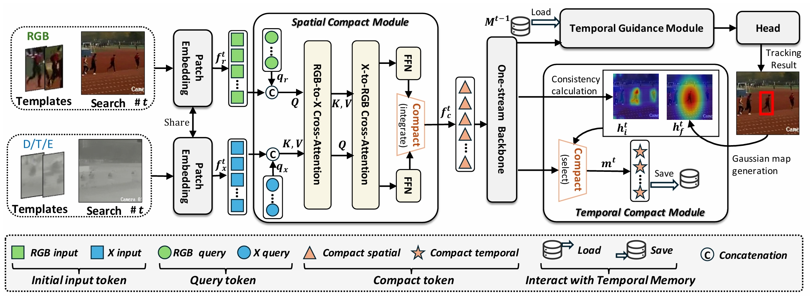

# CSTrack: Enhancing RGB-X Tracking via Compact Spatiotemporal Features

> [Xiaokun Feng](https://scholar.google.com.hk/citations?user=NqXtIPIAAAAJ), [Dailing Zhang](https://scholar.google.com.hk/citations?user=ApH4wOcAAAAJ), [Shiyu Hu](https://huuuuusy.github.io/), [Xuchen Li](https://github.com/Xuchen-Li), [Meiqi Wu](https://scholar.google.com.hk/citations?user=fGc7NVAAAAAJ), [Jing Zhang](https://github.com/XiaokunFeng/CSTrack), [Xiaotang Chen](http://www.ia.cas.cn/rcdw/fyjy/202404/t20240422_7129814.html), [Kaiqi Huang](https://people.ucas.ac.cn/~0004554)


[](https://arxiv.org/abs/2505.19434)
[](https://huggingface.co/Xiaokunfeng2022/CSTrack)

This is an official pytorch implementation of the paper **CSTrack: Enhancing RGB-X Tracking via Compact Spatiotemporal Features**.


## 🔥 Updates

*   \[5/2024\] **CStrack's** code is available!
*   \[5/2024\] **CStrack**  is accepted by ICML25!

## 📣 Overview
### Our motivation & Core modeling approach

Effectively modeling and utilizing spatiotemporal features from RGB and other modalities (e.g., depth, thermal, and event data, denoted as X) is the core of RGB-X tracker design. 
Existing methods often employ two parallel branches to separately process the RGB and X input streams, requiring the model to simultaneously handle two dispersed feature spaces, which complicates both the model structure and computation process. 
More critically, intra-modality spatial modeling within each dispersed space incurs substantial computational overhead, limiting resources for inter-modality spatial modeling and temporal modeling.
To address this, we propose a novel tracker, **CSTrack**, which focuses on modeling **C**ompact **S**patiotemporal features to achieve simple yet effective tracking.
Specifically, we first introduce an innovative **Spatial Compact Module** that integrates the RGB-X dual input streams into a compact spatial feature, enabling thorough intra- and inter-modality spatial modeling. 
Additionally, we design an efficient **Temporal Compact Module** that compactly represents temporal features by constructing the refined target distribution heatmap. 
Extensive experiments validate the effectiveness of our compact spatiotemporal modeling method, with CSTrack achieving new SOTA results on mainstream RGB-X benchmarks.


### Strong performance

| Tracker    | LasHeR (AUC) | RGBT234 (MSR) | VOT-RGBD22 (EAO) | DepthTrack (F-score) | VisEvent (AUC) | 
|------------|--------------|---------------|------------------|----------------------|----------------|
| **CSTrack** | **60.8**     | **70.9**      | **77.4**         | **65.8**             | **65.2**       |
| SDSTrack   | 53.1         | 62.5          | 72.8             | 61.9                 | 59.7           |
| OneTracker | 53.8         | 62.5          | 72.7             | 60.9                 | 60.8           |
| ViPT       | 52.5         | 61.7          | 72.1             | 59.6                 | 59.2           |
| UnTrack    | 51.3         | 62.5          | 72.1             | 61.0                 | 58.9           |


## 🔨 Installation
```
conda create -n cstrack python=3.8
conda activate cstrack
bash install.sh
```

## 🔧 Usage

### Data Preparation
Our CSTrack is jointly trained on RGB and RGB-D/T/E datasets.  
Put these tracking datasets in [./data](data). It should look like:

For RGB datasets:
   ```
   ${CSTrack_ROOT}
    -- data
        -- lasot
            |-- airplane
            |-- basketball
            |-- bear
            ...
        -- got10k
            |-- test
            |-- train
            |-- val
        -- coco
            |-- annotations
            |-- images
        -- trackingnet
            |-- TRAIN_0
            |-- TRAIN_1
            ...
            |-- TRAIN_11
            |-- TEST
        -- VastTrack
            |-- unisot_train_final_backup
                |-- Aardwolf
                ...
                |-- Zither
            |-- unisot_final_test
                |-- Aardwolf
                ...
                |-- Zither
        -- tnl2k
            -- train
                |-- Arrow_Video_ZZ04_done
                |-- Assassin_video_1-Done
                |-- Assassin_video_2-Done
                ...
            -- test
                |-- advSamp_Baseball_game_002-Done
                |-- advSamp_Baseball_video_01-Done
                |-- advSamp_Baseball_video_02-Done
                ...

   ```
For  RGB-D/T/E datasets:
   ```
   ${CSTrack_ROOT}
    -- data
        -- depthtrack
            -- train
                |-- adapter02_indoor
                |-- bag03_indoor
                |-- bag04_indoor
                ...
        -- lasher
            -- trainingset
                |-- 1boygo
                |-- 1handsth
                |-- 1phoneblue
                ...
            -- testingset
                |-- 1blackteacher
                |-- 1boycoming
                |-- 1stcol4thboy
                ...
        -- visevent
            -- train
                |-- 00142_tank_outdoor2
                |-- 00143_tank_outdoor2
                |-- 00144_tank_outdoor2
                ...
            -- test
                |-- 00141_tank_outdoor2
                |-- 00147_tank_outdoor2
                |-- 00197_driving_outdoor3
                ...
            -- annos
   ```
### Set project paths
Run the following command to set paths for this project
```
python tracking/create_default_local_file.py --workspace_dir . --data_dir ./data --save_dir .
```
After running this command, you can also modify paths by editing these two files
```
lib/train/admin/local.py  # paths about training
lib/test/evaluation/local.py  # paths about testing
```

### Train
#### Prepare pretrained backbone
The backbone and patch embedding of CSTrack are initialized with pre-trained weights from [**Fast-iTPN**](https://github.com/sunsmarterjie/iTPN).  
Please download the **fast_itpn_base_clipl_e1600.pt**  checkpoint and place it in [./resource/pretrained_models](./resource/pretrained_models).

#### Stage1: Train CSTrack without Temporal Compact Module
```
python -m torch.distributed.launch --nproc_per_node 4 lib/train/run_training.py --script cstrack_s1 --config cstrack_s1 --save_dir .
```


#### Stage2: Train CSTrack with Temporal Compact Module
Then, run the following command:
First, you need to set the **PRETRAINED_PATH** in [./experiments/cstrack_s2/cstrack_s2.yaml](./experiments/cstrack_s2/cstrack_s2.yaml)  to the path of the model weights obtained from Stage 1 training.  
Then, run the following command:

```
python -m torch.distributed.launch --nproc_per_node 4 lib/train/run_training.py --script cstrack_s2 --config cstrack_s2 --save_dir .
```


### Test and evaluate on benchmarks
First, you need to set **settings.checkpoints_path** in [./lib/test/evaluation/local.py](./lib/test/evaluation/local.py) to the dir where the model checkpoint to be evaluated is stored.  
Then, run the following command to perform evaluation on different benchmarks.

- LasHeR
```
# For stage1 
python ./RGBT_workspace/test_rgbt_mgpus.py --script_name cstrack_s1 --dataset_name LasHeR --yaml_name cstrack_s1

# For stage2 
python ./RGBT_workspace/test_rgbt_mgpus.py --script_name cstrack_s2 --dataset_name LasHeR --yaml_name cstrack_s2

# Through this command, you can obtain the tracking result. Then, please use the official matlab toolkit to evaluate the result. 
```
- RGBT-234
```
# For stage1 
python ./RGBT_workspace/test_rgbt_mgpus.py --script_name cstrack_s1 --dataset_name RGBT234 --yaml_name cstrack_s1

# For stage2 
python ./RGBT_workspace/test_rgbt_mgpus.py --script_name cstrack_s2 --dataset_name RGBT234 --yaml_name cstrack_s2

# Through this command, you can obtain the tracking result. Then, please use the official matlab toolkit to evaluate the result. 
```
- VisEvent
```
# For stage1 
python ./RGBE_workspace/test_rgbe_mgpus.py --script_name cstrack_s1 --dataset_name VisEvent --yaml_name cstrack_s1

# For stage2 
python ./RGBE_workspace/test_rgbe_mgpus.py --script_name cstrack_s2 --dataset_name VisEvent --yaml_name cstrack_s2
# Through this command, you can obtain the tracking result. Then, please use the official matlab toolkit to evaluate the result. 
```
- DepthTrack
```
cd Depthtrack_workspace
# For stage1 
vot evaluate cstrack_s1
vot analysis cstrack_s1 --nocache

# For stage2 
vot evaluate cstrack_s2
vot analysis cstrack_s2 --nocache
```
- VOT-RGBD22
```
cd VOT22RGBD_workspace
# For stage1 
vot evaluate cstrack_s1
vot analysis cstrack_s1 --nocache

# For stage2 
vot evaluate cstrack_s2
vot analysis cstrack_s2 --nocache
```

## 📊 Model Zoo
The trained models, and the raw tracking results are provided in the [](https://huggingface.co/Xiaokunfeng2022/CSTrack)

## ❤️Acknowledgement
We would like to express our gratitude to the following open-source repositories that our work is based on: [SeqtrackV2](https://github.com/chenxin-dlut/SeqTrackv2), [SUTrack](https://github.com/chenxin-dlut/SUTrack), [ViPT](https://github.com/jiawen-zhu/ViPT), [AQATrack](https://github.com/GXNU-ZhongLab/AQATrack), [iTPN](https://github.com/sunsmarterjie/iTPN).
Their contributions have been invaluable to this project.


